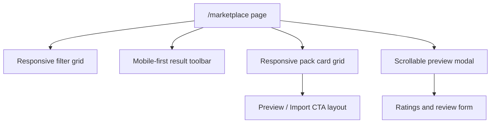

# PR Note: T026 Marketplace Mobile Responsive Cleanup

## Summary

This slice keeps the marketplace data flow unchanged and focuses on mobile/tablet usability. The page now uses a more forgiving filter grid, a stacked mobile action bar, denser but safer pack-card spacing, and a scrollable preview modal that fits narrow and short viewports.

## Architecture

## Files

- `web/app/(utility)/marketplace/page.tsx`

## Verification

- `cd web && npm ci`
- `cd web && npm run build`

## MAIN_SYSTEM_MAP

Updated: `no`
