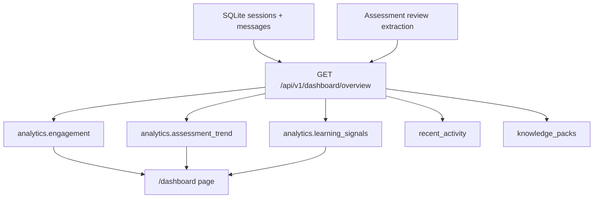

# PR Note: T027 Teacher Analytics Dashboard

## Summary

This slice extends the existing dashboard overview payload with teacher-facing analytics derived from the current session and assessment-review data. It adds three high-signal sections: engagement, assessment trend, and learning signals, while keeping the existing filters, recent activity list, and student progress route intact.

## Architecture

## Files

- `deeptutor/api/routers/dashboard.py`
- `web/lib/dashboard-api.ts`
- `web/app/(workspace)/dashboard/page.tsx`
- `tests/api/test_dashboard_router.py`
- `ai_first/architecture/MAIN_SYSTEM_MAP.md`

## Verification

- `python3 -m pytest tests/api/test_dashboard_router.py -q`
- `python3 -m py_compile deeptutor/api/routers/dashboard.py`
- `cd web && npm run build`

## MAIN_SYSTEM_MAP

Updated: `yes`
