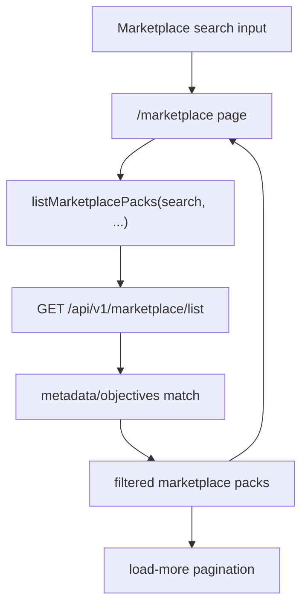

# PR Note: T029 Marketplace Full-Text Search

## Summary

This slice upgrades marketplace search from a narrow client-only filter to an API-backed metadata search. The existing list route now accepts a `search` query, matches against compact pack metadata and learning objectives, and the marketplace page passes the current search term through the cached list API so pagination and result counts stay coherent.

## Architecture

## Files

- `deeptutor/api/routers/marketplace.py`
- `web/lib/marketplace-api.ts`
- `web/app/(utility)/marketplace/page.tsx`
- `tests/api/test_marketplace_router.py`

## Verification

- `python3 -m pytest tests/api/test_marketplace_router.py -q`
- `python3 -m py_compile deeptutor/api/routers/marketplace.py`
- `cd web && npm run build`

## MAIN_SYSTEM_MAP

Updated: `no`
