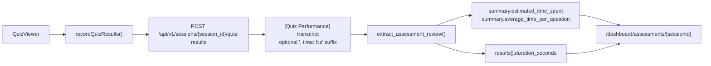

# T030 Assessment Time Tracking & Analytics

## Summary

- Extended the existing quiz result payload with optional `duration_seconds` so assessment answers can carry lightweight timing data without a new persistence schema.
- Serialized timing into the existing `[Quiz Performance]` transcript and parsed it back in the assessment review service.
- Surfaced total time, average time per question, and optional per-question response time in the assessment review UI.

## Architecture

## Notes

- Backward compatibility is preserved for older sessions that do not have timing data.
- `ai_first/architecture/MAIN_SYSTEM_MAP.md` was updated for this change.
