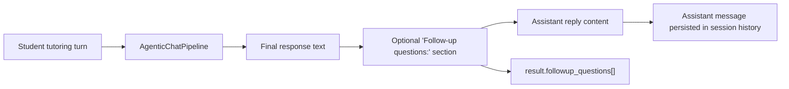

# T031 Smart Tutor Follow-Up Questions

## Summary

- Added a lightweight tutor follow-up slice to the agentic chat pipeline.
- The tutor can now end a response with a visible `Follow-up questions:` section containing 1-3 short numbered prompts when the learner still seems unsure.
- The same section is parsed back into `result.followup_questions` metadata so future UI work can reuse it without changing the chat route now.

## Architecture

## Notes

- This slice stays backend-only and reuses the current chat response surface.
- `ai_first/architecture/MAIN_SYSTEM_MAP.md` was updated for this change.
