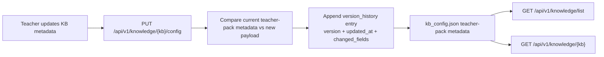

# T032 Knowledge Pack Versioning System

## Summary

- Added a lightweight versioning layer to teacher-pack metadata updates.
- Knowledge-pack config updates now auto-record `current_version` and append `version_history` entries when teacher-pack metadata actually changes.
- Existing knowledge packs remain backward-compatible when version metadata is absent.

## Architecture

## Notes

- This slice stays backend-first and does not require a new knowledge-pack route family.
- `ai_first/architecture/MAIN_SYSTEM_MAP.md` was updated for this change.
