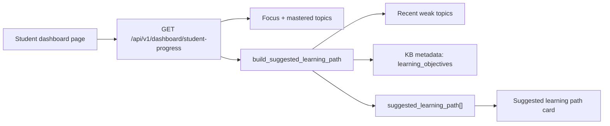

# T033 Suggested Learning Path Sequencing

## Summary

- Extended the existing student progress payload with a lightweight `suggested_learning_path` sequence.
- The first slice is deterministic: weak topics are surfaced first, then unmet knowledge-pack `learning_objectives`.
- The student dashboard now renders the sequence directly without introducing a new route family.

## Architecture

## Notes

- This slice stays inside the current dashboard contract and remains backward-compatible by returning an empty list when there is no usable sequence.
- `ai_first/architecture/MAIN_SYSTEM_MAP.md` was updated for this change.
