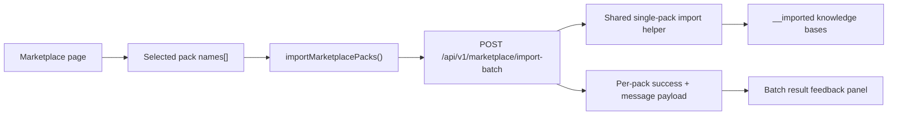

# T034 Batch Import Multiple Packs

## Summary

- Added a minimal batch-import API for marketplace packs.
- Reused the existing single-pack import behavior for each selected pack and returned per-pack results.
- Extended the marketplace UI with multi-select checkboxes, a batch action bar, and result feedback while preserving the single-pack import button.

## Architecture

## Notes

- This slice keeps the batch flow deterministic and backend-light by iterating through the same import helper used for one pack.
- `ai_first/architecture/MAIN_SYSTEM_MAP.md` was updated for this change.
