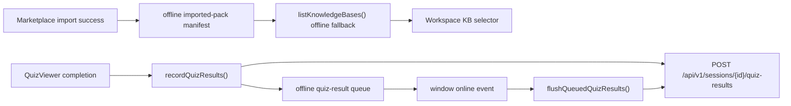

# T035 Offline Mode for Downloaded Packs

## Summary

- Added a browser-local manifest for imported packs so downloaded packs can still appear when the knowledge-list API is unavailable.
- Added a browser-local queue for quiz result recording so a loaded assessment can be completed offline and synced later.
- Kept the first slice frontend-only and reversible without introducing a full service-worker/PWA stack.

## Architecture

## Notes

- This slice intentionally focuses on imported-pack visibility plus deferred quiz-result sync, not on a full offline generation pipeline.
- `ai_first/architecture/MAIN_SYSTEM_MAP.md` was updated for this change.
