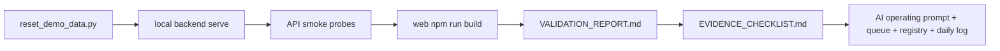

# T036 Contest Smoke and Evidence Refresh

## Summary

- Re-ran the contest smoke lane on 2026-04-24 using the scripted demo reset plus current local backend/frontend validation.
- Refreshed command-backed evidence status in `docs/contest/VALIDATION_REPORT.md`.
- Marked screenshot evidence `Stale` in `docs/contest/EVIDENCE_CHECKLIST.md` because recent UI merges were not followed by a fresh human capture.
- Updated AI-first control-plane docs to track the derived short task and the refreshed evidence state.

## Architecture

## Notes

- `ai_first/architecture/MAIN_SYSTEM_MAP.md` was not updated because this lane changed evidence and control-plane docs only.
- The smoke run passed on 2026-04-24, but screenshot evidence remains stale until a human recapture refreshes the UI bundle.
