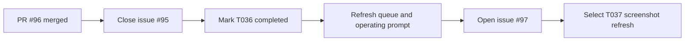

# T036 Post-Merge Sync and T037 Selection

## Summary

- Synced control-plane docs after PR `#96` merged so `T036` is recorded as completed on `main`.
- Closed issue `#95` and advanced the latest merged result and queue state.
- Opened follow-up issue `#97` and created the next short task packet for contest screenshot evidence refresh.

## Architecture

## Notes

- `ai_first/architecture/MAIN_SYSTEM_MAP.md` was not updated because this lane changes tracking and evidence workflow docs only.
