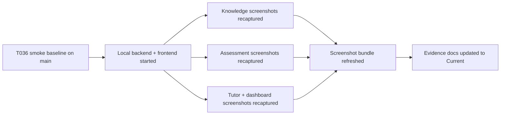

# T037 Contest Screenshot Evidence Refresh

## Summary

- refreshed the linked contest screenshot bundle on 2026-04-24 against the latest merged UI
- reused the smoke-backed command evidence already established by `T036`
- moved screenshot evidence status from `Stale` back to `Current`
- kept the change docs-only; `ai_first/architecture/MAIN_SYSTEM_MAP.md` did not change

## Flow

## Files

- `docs/contest/screenshots/*`
- `docs/contest/EVIDENCE_CHECKLIST.md`
- `docs/contest/VALIDATION_REPORT.md`
- `docs/superpowers/tasks/2026-04-24-T037-contest-screenshot-refresh.md`
- `ai_first/TASK_REGISTRY.json`
- `ai_first/EXECUTION_QUEUE.md`
- `ai_first/AI_OPERATING_PROMPT.md`
- `ai_first/daily/2026-04-24.md`
