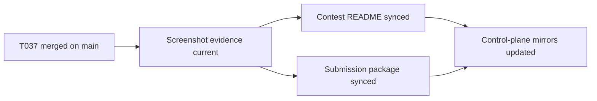

# T038 Contest Submission Package Freshness Sync

## Summary

- synced the contest-facing README and submission package to the latest 2026-04-24 smoke/evidence state
- advanced control-plane tracking from `T037` complete to `T038` in progress
- kept the change docs-only; `ai_first/architecture/MAIN_SYSTEM_MAP.md` did not change

## Flow

## Files

- `docs/contest/README.md`
- `docs/contest/SUBMISSION_PACKAGE.md`
- `ai_first/AI_OPERATING_PROMPT.md`
- `ai_first/EXECUTION_QUEUE.md`
- `ai_first/TASK_REGISTRY.json`
- `ai_first/daily/2026-04-24.md`
- `docs/superpowers/tasks/2026-04-24-T038-contest-submission-readiness-sync.md`
