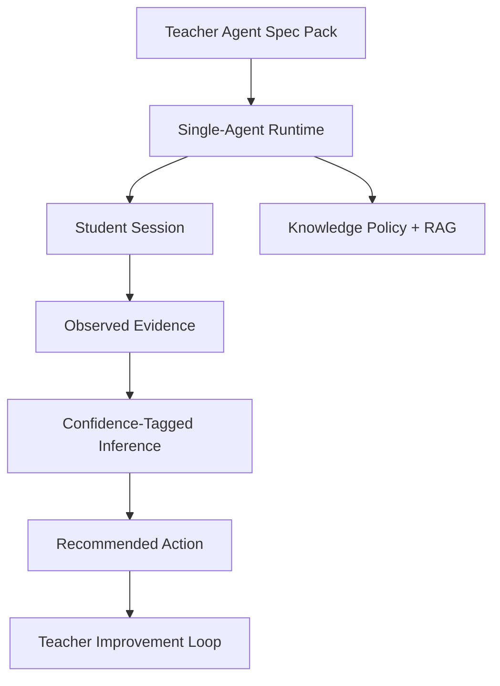

# PR Note - Teacher-Agent Platform Doctrine

## Summary

This PR adds the post-MVP design baseline for a teacher-defined agent platform and records the AI-first engineering doctrine needed to keep the codebase scalable, isolated, and safe for future AI-driven expansion.

## Why

The repo needed a durable product and engineering reference for work beyond the current MVP queue. The goal is to preserve a clean single-agent core now while protecting the architecture needed for future multi-agent evolution and national-scale growth.

## Scope

- Added a teacher-agent platform design spec
- Added a long-form engineering philosophy under `ai_first/`
- Added a short mandatory engineering doctrine to the operating prompt
- Added a daily log entry for the design decision

## Architecture impact

- No runtime or API behavior changes in this PR
- No `MAIN_SYSTEM_MAP.md` update required because this PR defines direction and doctrine only
- Future teacher-agent work should treat policy, runtime, retrieval, observation, diagnosis, and intervention as separate layers

## Validation

- No tests run; docs and operating-layer update only
