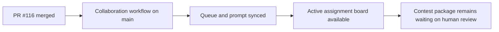

# Post-116 Two-Person Collaboration Wait-State Sync

## Summary

- recorded PR `#116` as the latest merged workflow result
- synced the queue and compact compatibility snapshots after the two-person collaboration workflow landed
- kept the change control-plane only; `ai_first/architecture/MAIN_SYSTEM_MAP.md` did not change

## Flow

## Files

- `ai_first/AI_OPERATING_PROMPT.md`
- `ai_first/EXECUTION_QUEUE.md`
- `ai_first/ACTIVE_ASSIGNMENTS.md`
- `ai_first/CURRENT_STATE.md`
- `ai_first/NEXT_ACTIONS.md`
- `ai_first/daily/2026-04-25.md`
- `docs/superpowers/tasks/2026-04-25-post-116-two-person-collab-sync.md`
