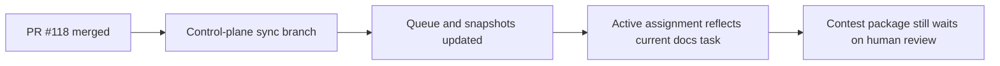

# Post-118 Control-Plane Sync

## Summary

- recorded PR `#118` as the latest merged workflow result
- synced the queue, prompt, snapshots, and active assignment board to the current branch state
- kept the change control-plane only; `ai_first/architecture/MAIN_SYSTEM_MAP.md` did not change

## Flow

## Files

- `ai_first/AI_OPERATING_PROMPT.md`
- `ai_first/EXECUTION_QUEUE.md`
- `ai_first/CURRENT_STATE.md`
- `ai_first/NEXT_ACTIONS.md`
- `ai_first/ACTIVE_ASSIGNMENTS.md`
- `ai_first/daily/2026-04-25.md`
- `docs/superpowers/tasks/2026-04-25-post-118-control-plane-sync.md`
