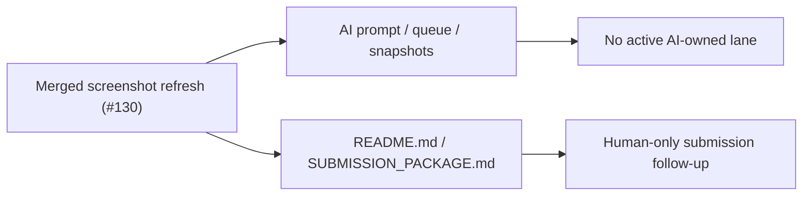

# Post-130 Screenshot Merge Sync

## Scope

- Remove the stale active-lane wording left behind after PR `#130` merged.
- Update the compact mirrors and contest entry docs to reflect the 2026-04-25 screenshot-refresh merge.
- `ai_first/architecture/MAIN_SYSTEM_MAP.md` not updated because this PR only syncs docs and operating mirrors.

## Architecture Note

