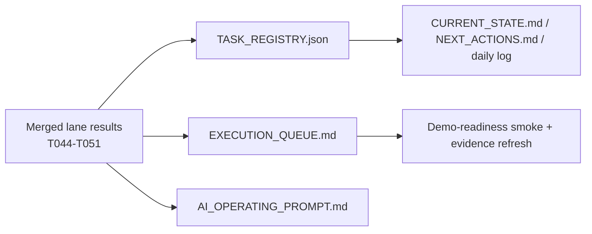

# Post-Lane Control-Plane Sync

## Scope

- Sync `ai_first/` mirrors after the two-lane contest MVP polish experiment completed.
- Mark `T044` through `T051` with merged status in the task registry.
- Point the queue and compatibility snapshots from lane bootstrap to smoke/evidence validation.
- `ai_first/architecture/MAIN_SYSTEM_MAP.md` not updated because no runtime architecture changed.

## Architecture Note

