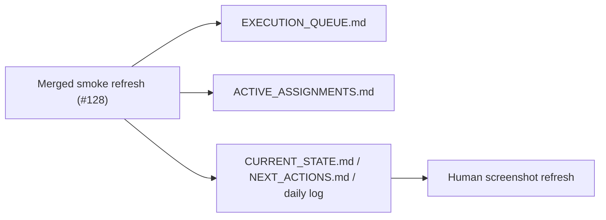

# Post-Smoke Control-Plane Cleanup

## Scope

- Remove the stale active smoke-lane status after PR `#128` merged.
- Keep the queue and snapshots aligned with the merged smoke/evidence state.
- Leave screenshot refresh as the only remaining follow-up.
- `ai_first/architecture/MAIN_SYSTEM_MAP.md` not updated because this PR only adjusts control-plane mirrors.

## Architecture Note

