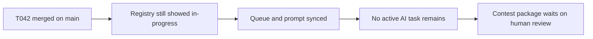

# Post-T042 Human Review Wait-State Sync

## Summary

- marked `T042` completed after PR `#109` merged
- cleared the stale active-queue state so the repo now reads as waiting on human review
- kept the change control-plane only; `ai_first/architecture/MAIN_SYSTEM_MAP.md` did not change

## Flow

## Files

- `ai_first/AI_OPERATING_PROMPT.md`
- `ai_first/EXECUTION_QUEUE.md`
- `ai_first/TASK_REGISTRY.json`
- `ai_first/daily/2026-04-25.md`
- `docs/superpowers/tasks/2026-04-25-post-t042-human-review-wait-state-sync.md`
