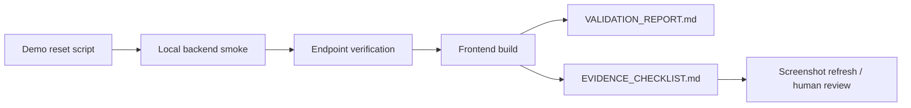

# T036 Smoke Refresh Rerun

## Scope

- Re-run the local contest smoke lane after `T044` through `T051` merged.
- Refresh `VALIDATION_REPORT.md` with 2026-04-25 command-backed evidence.
- Mark screenshot evidence `Stale` in `EVIDENCE_CHECKLIST.md` because the last capture predates the merged contest-facing UI changes.
- `ai_first/architecture/MAIN_SYSTEM_MAP.md` not updated because this PR only refreshes docs and control-plane evidence state.

## Architecture Note

