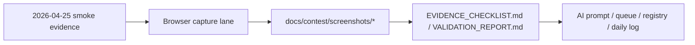

# T037 Screenshot Refresh Pass

## Scope

- Refresh the contest screenshot bundle after the merged UI changes from `T044` through `T051`.
- Move screenshot evidence from `Stale` back to `Current` in the contest docs.
- Keep the control-plane mirrors aligned with the refreshed evidence lane.
- `ai_first/architecture/MAIN_SYSTEM_MAP.md` not updated because this PR only refreshes evidence artifacts and control-plane docs.

## Architecture Note

## Evidence Notes

- `01`, `02`, `04`, `05`, and `06` were captured directly from the current merged UI in a fresh worktree.
- `07` and `08` use demo-safe local session content in the worktree `data/` directory because the configured local provider key remained a placeholder during capture.
