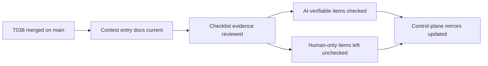

# T039 Submission Checklist Evidence Alignment

## Summary

- aligned the final contest submission checklist with AI-verifiable repo evidence
- kept human-only review items explicitly unchecked
- advanced control-plane tracking from `T038` complete to `T039` in progress
- kept the change docs-only; `ai_first/architecture/MAIN_SYSTEM_MAP.md` did not change

## Flow

## Files

- `ai_first/competition/submission-checklist.md`
- `docs/contest/SUBMISSION_PACKAGE.md`
- `ai_first/AI_OPERATING_PROMPT.md`
- `ai_first/EXECUTION_QUEUE.md`
- `ai_first/TASK_REGISTRY.json`
- `ai_first/daily/2026-04-25.md`
- `docs/superpowers/tasks/2026-04-25-T039-submission-checklist-alignment.md`
