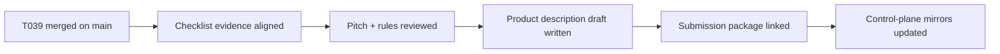

# T040 Contest Product Description Draft

## Summary

- drafted the contest product description from current MVP evidence, pitch notes, and submission materials
- linked the draft into the submission package and checklist
- advanced control-plane tracking from `T039` complete to `T040` in progress
- kept the change docs-only; `ai_first/architecture/MAIN_SYSTEM_MAP.md` did not change

## Flow

## Files

- `ai_first/competition/product-description.md`
- `ai_first/competition/submission-checklist.md`
- `docs/contest/SUBMISSION_PACKAGE.md`
- `ai_first/AI_OPERATING_PROMPT.md`
- `ai_first/EXECUTION_QUEUE.md`
- `ai_first/TASK_REGISTRY.json`
- `ai_first/daily/2026-04-25.md`
- `docs/superpowers/tasks/2026-04-25-T040-contest-product-description.md`
