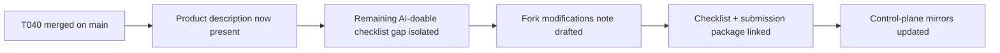

# T041 Contest Fork Modifications Note

## Summary

- added a concise fork-modifications note describing how this repo extends HKUDS/DeepTutor for the contest MVP
- linked that note into the final submission checklist and submission package
- advanced control-plane tracking from `T040` complete to `T041` in progress
- kept the change docs-only; `ai_first/architecture/MAIN_SYSTEM_MAP.md` did not change

## Flow

## Files

- `ai_first/competition/fork-modifications.md`
- `ai_first/competition/submission-checklist.md`
- `docs/contest/SUBMISSION_PACKAGE.md`
- `ai_first/AI_OPERATING_PROMPT.md`
- `ai_first/EXECUTION_QUEUE.md`
- `ai_first/TASK_REGISTRY.json`
- `ai_first/daily/2026-04-25.md`
- `docs/superpowers/tasks/2026-04-25-T041-contest-fork-modifications.md`
