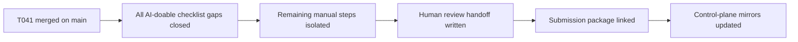

# T042 Contest Human Review Handoff

## Summary

- added a short human-review handoff doc for the remaining manual submission steps
- linked the handoff into the submission package so the final review path is explicit
- advanced control-plane tracking from `T041` complete to `T042` in progress
- kept the change docs-only; `ai_first/architecture/MAIN_SYSTEM_MAP.md` did not change

## Flow

## Files

- `docs/contest/HUMAN_REVIEW_HANDOFF.md`
- `docs/contest/SUBMISSION_PACKAGE.md`
- `ai_first/AI_OPERATING_PROMPT.md`
- `ai_first/EXECUTION_QUEUE.md`
- `ai_first/TASK_REGISTRY.json`
- `ai_first/daily/2026-04-25.md`
- `docs/superpowers/tasks/2026-04-25-T042-contest-human-review-handoff.md`
