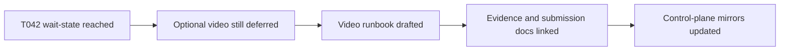

# T043 Optional Contest Video Capture Runbook

## Summary

- added an optional video storyboard/runbook for the contest package
- linked the runbook into evidence, submission, and human handoff docs
- advanced control-plane tracking from the waiting-on-human-review state to `T043` optional video support
- kept the change docs-only; `ai_first/architecture/MAIN_SYSTEM_MAP.md` did not change

## Flow

## Files

- `docs/contest/VIDEO_CAPTURE_RUNBOOK.md`
- `docs/contest/EVIDENCE_CHECKLIST.md`
- `docs/contest/SUBMISSION_PACKAGE.md`
- `docs/contest/HUMAN_REVIEW_HANDOFF.md`
- `ai_first/AI_OPERATING_PROMPT.md`
- `ai_first/EXECUTION_QUEUE.md`
- `ai_first/TASK_REGISTRY.json`
- `ai_first/daily/2026-04-25.md`
- `docs/superpowers/tasks/2026-04-25-T043-optional-video-capture-runbook.md`
