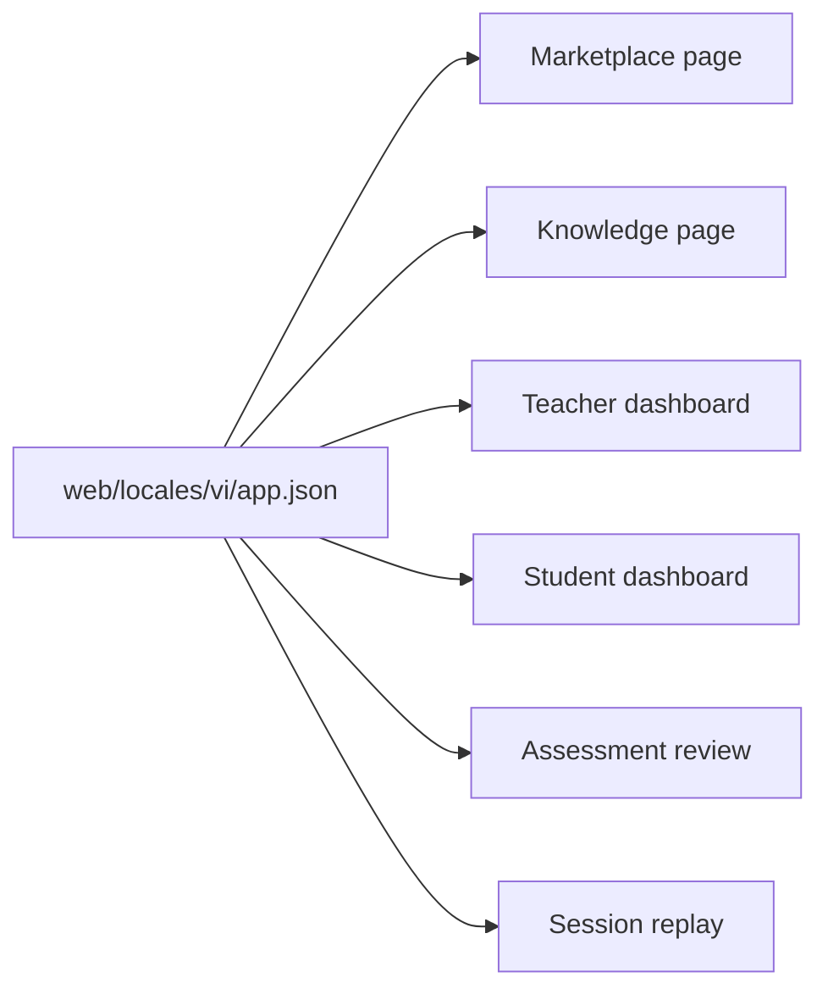

# T044 Contest Vietnamese Coverage

## Scope

- Localize contest MVP copy on marketplace, knowledge, dashboard, assessment review, and tutoring replay pages.
- Keep the slice frontend-only with no API or backend contract changes.
- Do not update `ai_first/architecture/MAIN_SYSTEM_MAP.md` because route structure and runtime behavior did not change.

## Architecture Note

