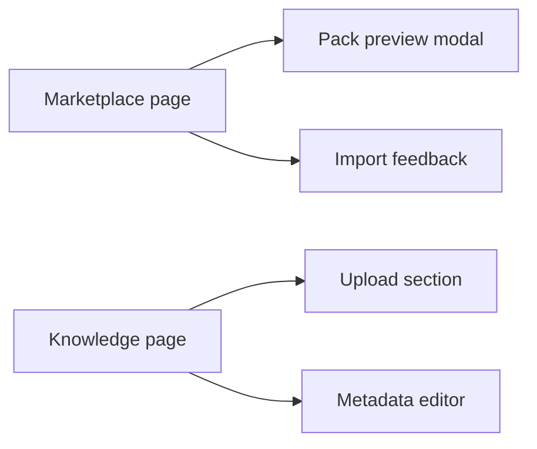

# T045 Marketplace and Knowledge Polish

## Scope

- Improve marketplace filter/card/preview hierarchy using existing frontend state.
- Improve knowledge-pack upload and metadata-edit feedback without changing API contracts.
- `ai_first/architecture/MAIN_SYSTEM_MAP.md` not updated because route structure is unchanged.

## Architecture Note

