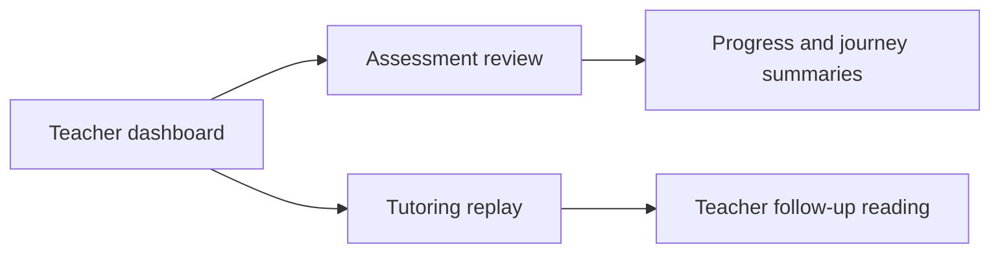

# T046 Dashboard Review Polish

## Scope

- Improve dashboard hierarchy and next-step framing.
- Improve assessment review and tutoring replay readability without changing contracts.
- `ai_first/architecture/MAIN_SYSTEM_MAP.md` not updated because route behavior is unchanged.

## Architecture Note

