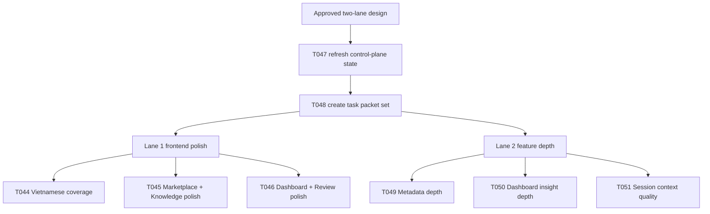

# T047/T048 Two-Lane Contest MVP Rollout

This docs/control-plane rollout turns the approved two-lane contest MVP polish design into executable repo state.

It does three things:

- expands `ai_first/TASK_REGISTRY.json` with `T044` through `T051`
- refreshes queue, prompt, snapshots, and assignment state so the repo no longer presents itself as waiting-only
- creates explicit task packets for both parallel lanes before product implementation starts

## Why

The original MVP backlog is complete, but the current app still shows product-polish gaps and uneven Vietnamese coverage on contest MVP screens.

The team also wants to test whether two real sessions on two accounts or machines can make progress in parallel without frequent file collisions.

That requires concrete ownership contracts, not just a prose design.

## Scope

- `ai_first/TASK_REGISTRY.json`
- `ai_first/AI_OPERATING_PROMPT.md`
- `ai_first/EXECUTION_QUEUE.md`
- `ai_first/ACTIVE_ASSIGNMENTS.md`
- `ai_first/CURRENT_STATE.md`
- `ai_first/NEXT_ACTIONS.md`
- `ai_first/daily/2026-04-25.md`
- `docs/superpowers/tasks/2026-04-25-T044-contest-vietnamese-coverage.md`
- `docs/superpowers/tasks/2026-04-25-T045-marketplace-knowledge-polish.md`
- `docs/superpowers/tasks/2026-04-25-T046-dashboard-review-polish.md`
- `docs/superpowers/tasks/2026-04-25-T047-contest-operating-hygiene-refresh.md`
- `docs/superpowers/tasks/2026-04-25-T048-parallel-lane-task-packets.md`
- `docs/superpowers/tasks/2026-04-25-T049-metadata-depth-pass.md`
- `docs/superpowers/tasks/2026-04-25-T050-dashboard-insight-depth.md`
- `docs/superpowers/tasks/2026-04-25-T051-session-context-quality-pass.md`

## Architecture

## Main system map

`ai_first/architecture/MAIN_SYSTEM_MAP.md` is not updated in this PR because the rollout only changes planning and operating docs, not the runtime feature structure itself.
