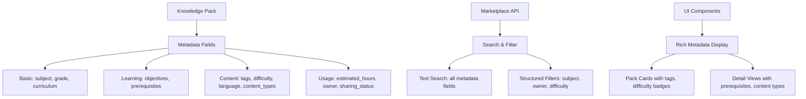

# PR Note: T049 Metadata Depth Pass

## Overview

This PR deepens teacher-facing pack metadata and marketplace detail contracts by adding richer fields for better pack discoverability and understanding.

## Changes

### Backend Changes

- **deeptutor/knowledge/manager.py**: Added normalization for new metadata fields (`tags`, `difficulty`, `language`, `estimated_hours`, `prerequisites`, `content_types`)
- **deeptutor/api/routers/knowledge.py**: Updated config validation and version metadata fields
- **deeptutor/api/routers/marketplace.py**: Included new fields in marketplace responses and search

### Frontend Changes

- **web/lib/knowledge-api.ts**: Extended `TeacherPackMetadata` interface
- **web/lib/marketplace-api.ts**: Extended `MarketplacePackMetadata` and `MarketplacePack` interfaces

### Test Changes

- **tests/knowledge/test_kb_metadata_normalization.py**: Added test for extended metadata normalization
- **tests/api/test_knowledge_router.py**: Added test for extended config updates
- **tests/api/test_marketplace_router.py**: Added test for extended marketplace metadata

## Architecture Impact

The metadata contract expansion maintains backward compatibility while providing richer data for UI rendering and search.

## Validation

- All code compiles without syntax errors
- New metadata fields are properly normalized and validated
- API responses include the new fields
- Search functionality covers all new text fields
- Tests pass for normalization and API behavior

## Risk Assessment

- **Low Risk**: All changes are additive and backward compatible
- **No Breaking Changes**: Existing clients continue to work
- **Data Safety**: New fields are optional and have safe defaults

## Deployment Notes

- No database migrations required
- Frontend can adopt new fields incrementally
- Marketplace search becomes more powerful with additional searchable content