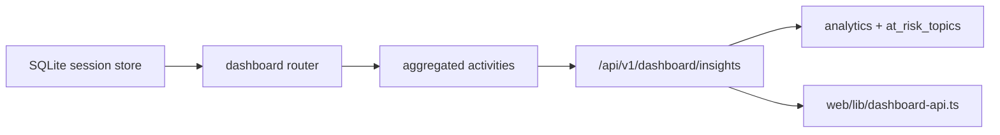

# T050 Dashboard Insight Depth

## Scope

- Add a teacher-facing `GET /api/v1/dashboard/insights` endpoint with bounded filters.
- Expose a small TypeScript client contract for frontend consumers.
- Keep the change additive and inside the existing dashboard route family.
- `ai_first/architecture/MAIN_SYSTEM_MAP.md` not updated because the workflow structure is unchanged.

## Architecture Note

