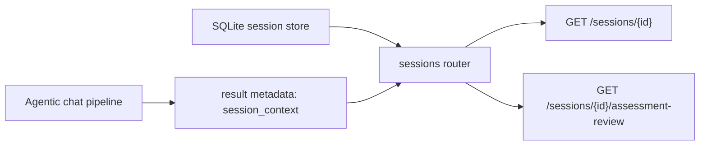

# T051 Session Context Quality Pass

## Scope

- Add additive `context_support` payloads to existing session and assessment-review routes.
- Add `session_context` metadata to tutoring result events for downstream consumers.
- Keep the implementation inside the current session/review/reply flow family.
- `ai_first/architecture/MAIN_SYSTEM_MAP.md` not updated because workflow structure is unchanged.

## Architecture Note

