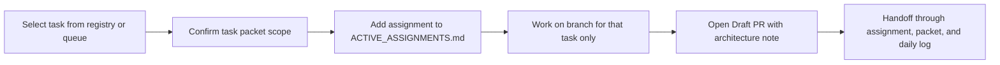

# Two-Person AI-First Collaboration

## Summary

- added a lightweight `ai_first/ACTIVE_ASSIGNMENTS.md` coordination board for active work
- encoded assignment-before-code and explicit scope rules in the operating prompt and shared templates
- kept the change process-only; `ai_first/architecture/MAIN_SYSTEM_MAP.md` did not change

## Flow

## Files

- `ai_first/ACTIVE_ASSIGNMENTS.md`
- `ai_first/AI_OPERATING_PROMPT.md`
- `ai_first/templates/feature-pod-task.md`
- `ai_first/templates/handoff-note.md`
- `docs/superpowers/tasks/templates/feature-pod-task.md`
- `docs/superpowers/tasks/README.md`
- `docs/superpowers/specs/2026-04-25-two-person-ai-first-collaboration-design.md`
- `docs/superpowers/plans/2026-04-25-two-person-ai-first-collaboration.md`
- `ai_first/daily/2026-04-25.md`
