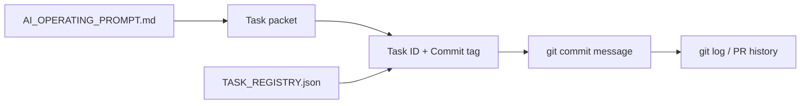

# PR Note: Commit Message Task ID Standard

## Summary

- add one repo-level commit message convention that always carries the active task identifier
- teach AI workers to read `Task ID` and `Commit tag` from the task packet before the first commit
- update the six active lane packets and the task packet template so future sessions do not guess commit suffixes

## Architecture

## Validation

- `rg -n "Commit message convention|Task ID|Commit tag|OPS-COMMIT|\\[L[1-6]\\]" ai_first docs/superpowers/tasks -S`
- `git diff --check`

## Main System Map

- Not updated; this PR is docs/workflow-only and does not change product/runtime architecture.
