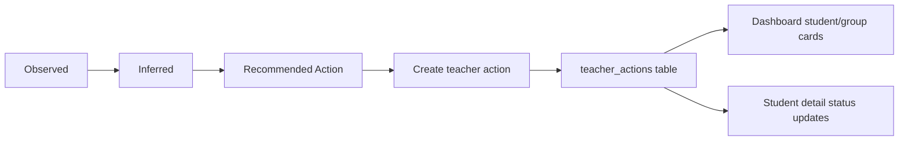

# F101 Teacher Action Execution Loop PR Note

## Changed

- added a bounded `teacher_actions` backend contract under the dashboard/evidence layer
- added create and status-update dashboard APIs:
  - `POST /api/v1/dashboard/teacher-actions`
  - `PATCH /api/v1/dashboard/teacher-actions/{action_id}`
- attached teacher actions back onto student and small-group insight payloads
- added overview action creation UI on student cards and small-group cards
- added a `Teacher actions` section with status updates in student detail
- updated `ai_first/architecture/MAIN_SYSTEM_MAP.md`

## Why

The dashboard previously stopped at `Recommended Action`. Teachers could see the next move, but could not turn that move into a first-class in-product execution record. `F101` closes that gap with a structured teacher-owned action loop while deliberately avoiding a full assignment-delivery system.

## Architecture

## Main System Map

`ai_first/architecture/MAIN_SYSTEM_MAP.md` **was updated** because this PR adds a new dashboard API surface and a new teacher-action data flow to the product layer.

## Tests run

- `pytest tests/api/test_dashboard_router.py::test_dashboard_teacher_action_create_round_trip tests/api/test_dashboard_router.py::test_dashboard_teacher_action_small_group_summary_attaches_to_group_card tests/api/test_dashboard_router.py::test_dashboard_teacher_action_status_update_round_trip tests/api/test_dashboard_router.py::test_dashboard_insights_returns_students_and_small_groups -q`
- `cd web && ./node_modules/.bin/eslint --config eslint.config.mjs components/dashboard/TeacherActionComposer.tsx components/dashboard/StudentInsightCard.tsx components/dashboard/SmallGroupInsightCard.tsx components/dashboard/StudentInsightDetail.tsx app/'(workspace)'/dashboard/student/page.tsx lib/dashboard-api.ts`
- `git diff --check`

## Risks

- teacher actions are execution records only, not student-facing assignments
- the first slice uses local dashboard/evidence persistence and does not yet model due dates, delivery, or class-level scheduling
- the small-group path relies on a generated `target_id` contract from the insight payload, so future group-model work must preserve or migrate that key carefully

## Next AI should read

1. `docs/superpowers/tasks/2026-04-26-f101-teacher-action-execution-loop.md`
2. `docs/superpowers/specs/2026-04-26-f101-teacher-action-execution-loop-design.md`
3. `docs/superpowers/plans/2026-04-26-f101-teacher-action-execution-loop.md`

## Suggested next action

After this merges cleanly, the natural follow-ups are:
- `F102_INTERVENTION_ASSIGNMENT_FLOW`
- `F103_RECOMMENDATION_ACKNOWLEDGEMENT_AND_STATUS`
- `F108_DIAGNOSIS_FEEDBACK_CAPTURE`
