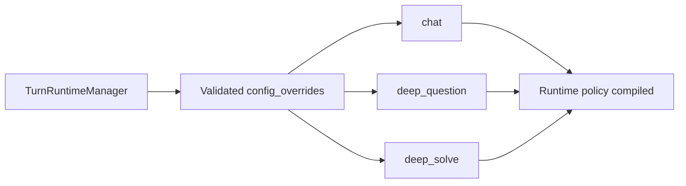

# PR Note: F113 Capability-Wide Runtime Binding Coverage

- Task: `F113_CAPABILITY_WIDE_RUNTIME_BINDING_COVERAGE`
- Scope: bounded runtime-policy coverage for `chat`, `deep_question`, and `deep_solve`
- Main-system-map update: required and included in this branch

## What Changed

- widened public request contracts so `deep_question` and `deep_solve` accept `agent_spec_id`
- preserved the existing `chat` runtime-binding proof
- added explicit bounded runtime-policy injection to `deep_solve`
- added unified-turn tests proving `config.agent_spec_id` survives request validation and reaches runtime policy assembly for all three covered capabilities
- kept the claim surface narrow: covered shipped turn paths only, not universal capability coverage

## Validation

- `pytest tests/core/test_capabilities_runtime.py tests/api/test_unified_ws_turn_runtime.py tests/services/runtime_policy/test_compiler.py -q`
- `git diff --check`
