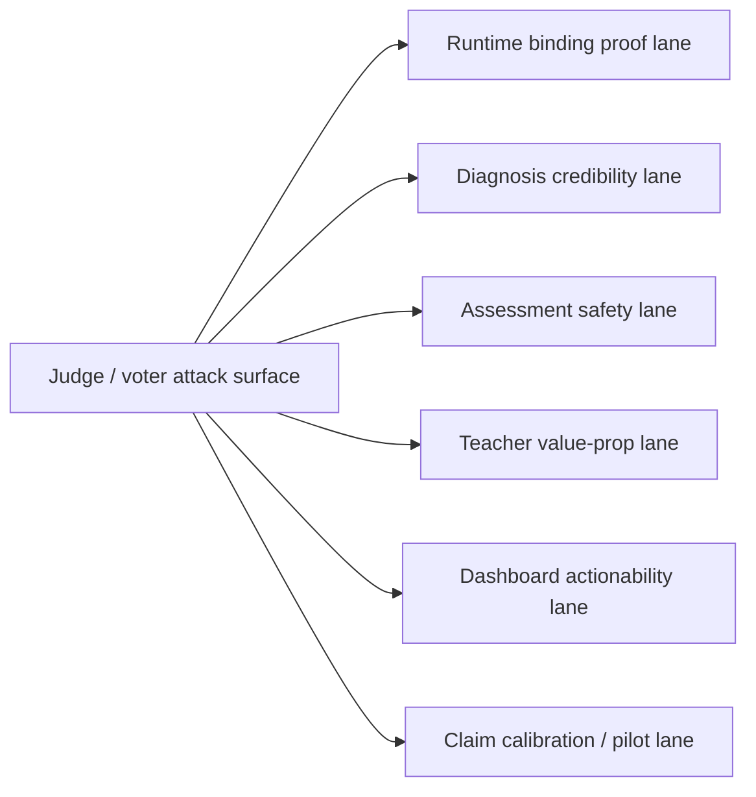

# PR Note: Judge-Risk Hardening Lane Packets

## Summary

- Converts likely judge and voter attack surfaces into six execution-ready lane packets.
- Keeps the work aligned with the current product instead of inventing speculative new features.
- Makes it possible to run one AI session per risk lane with bounded ownership and clearer proof goals.

## Architecture impact

- `ai_first/architecture/MAIN_SYSTEM_MAP.md` was not updated because this PR creates planning/execution packets, not new runtime structure.

## Files changed

- `docs/superpowers/tasks/2026-04-26-risk-lane-1-runtime-binding-proof.md`
- `docs/superpowers/tasks/2026-04-26-risk-lane-2-diagnosis-credibility.md`
- `docs/superpowers/tasks/2026-04-26-risk-lane-3-assessment-safety.md`
- `docs/superpowers/tasks/2026-04-26-risk-lane-4-teacher-value-prop.md`
- `docs/superpowers/tasks/2026-04-26-risk-lane-5-dashboard-actionability.md`
- `docs/superpowers/tasks/2026-04-26-risk-lane-6-claim-calibration-and-pilot.md`
- `ai_first/ACTIVE_ASSIGNMENTS.md`
- `ai_first/daily/2026-04-26.md`
- `docs/superpowers/pr-notes/2026-04-26-judge-risk-hardening-lanes.md`

## Validation

- `rg -n "R1_RUNTIME_BINDING_PROOF|R2_DIAGNOSIS_CREDIBILITY|R3_ASSESSMENT_SAFETY|R4_TEACHER_VALUE_PROP|R5_DASHBOARD_ACTIONABILITY|R6_CLAIM_CALIBRATION_PILOT" docs/superpowers/tasks ai_first -S`
- `git diff --check -- ai_first/ACTIVE_ASSIGNMENTS.md ai_first/daily/2026-04-26.md docs/superpowers/tasks/2026-04-26-risk-lane-1-runtime-binding-proof.md docs/superpowers/tasks/2026-04-26-risk-lane-2-diagnosis-credibility.md docs/superpowers/tasks/2026-04-26-risk-lane-3-assessment-safety.md docs/superpowers/tasks/2026-04-26-risk-lane-4-teacher-value-prop.md docs/superpowers/tasks/2026-04-26-risk-lane-5-dashboard-actionability.md docs/superpowers/tasks/2026-04-26-risk-lane-6-claim-calibration-and-pilot.md docs/superpowers/pr-notes/2026-04-26-judge-risk-hardening-lanes.md`
