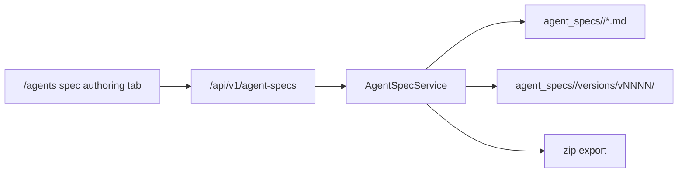

# PR Note: Lane 1 Agent Spec Authoring

## Summary

- add a new `agent_specs` backend service and API for teacher-defined markdown spec packs
- add a teacher-facing authoring tab on `/agents` with structured editing for `IDENTITY`, `SOUL`, and `RULES`
- keep the remaining spec files markdown-first, version them on save, and support zip export

## Architecture

## Validation

- `pytest tests/services/agent_spec/test_service.py tests/api/test_agent_specs_router.py -q`
- `./node_modules/.bin/eslint --config eslint.config.mjs app/'(workspace)'/agents/page.tsx components/agents/SpecPackAuthoringTab.tsx lib/agent-spec-api.ts`
- `git diff --check`

## Main System Map

- Updated `ai_first/architecture/MAIN_SYSTEM_MAP.md` for the new authoring surface, API, and storage path.
