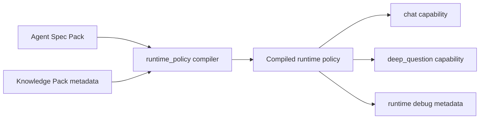

# PR Note: Lane 2 Spec Runtime Assembly

## Summary

- extend `runtime_policy` so runtime can resolve an authored spec pack by `agent_spec_id` and normalize it into explicit policy slices
- add a prompt-manager helper for deterministic runtime policy prompt assembly instead of ad hoc string concatenation
- keep tutoring and assessment on the same runtime contract while preserving legacy behavior when no teacher policy is present

## Architecture

## Validation

- `pytest tests/services/runtime_policy/test_compiler.py tests/services/test_prompt_manager.py tests/core/test_capabilities_runtime.py::test_chat_capability_streams_content_and_geogebra_context tests/core/test_capabilities_runtime.py::test_chat_capability_resolves_runtime_policy_from_agent_spec_pack tests/core/test_capabilities_runtime.py::test_deep_question_capability_uses_user_message_as_topic tests/core/test_capabilities_runtime.py::test_deep_question_capability_uses_single_call_followup_agent -q`
- `git diff --check`

## Main System Map

- Updated `ai_first/architecture/MAIN_SYSTEM_MAP.md` for the shared runtime-policy compiler boundary.
