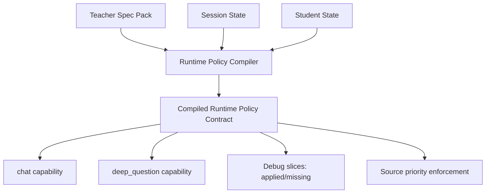

# PR Architecture Note: Lane 2 Spec Runtime Assembly

## Summary

This PR introduces a shared runtime policy assembly contract so tutoring and assessment flows consume the same teacher-spec policy slices at runtime.

## Architectural changes

- Add shared runtime policy compiler under `deeptutor/services/runtime_policy/`.
- Compile explicit policy slices (`SOUL`, `RULES`, `WORKFLOW`, `ASSESSMENT`, `KNOWLEDGE`) with deterministic source priority.
- Inject compiled runtime policy in orchestrator before capability execution.
- Apply assembled policy context in both `chat` and `deep_question` capabilities.
- Emit runtime debug metadata for assembled slice visibility.

## Main system map status

- `ai_first/architecture/MAIN_SYSTEM_MAP.md` updated in this PR.

## Validation

- `pytest tests/services/runtime_policy/test_compiler.py -vv`
- `pytest tests/core/test_capabilities_runtime.py::test_chat_capability_streams_content_and_geogebra_context -vv -s`
- `pytest tests/core/test_capabilities_runtime.py::test_deep_question_capability_uses_user_message_as_topic -vv`
- `git diff --check`
