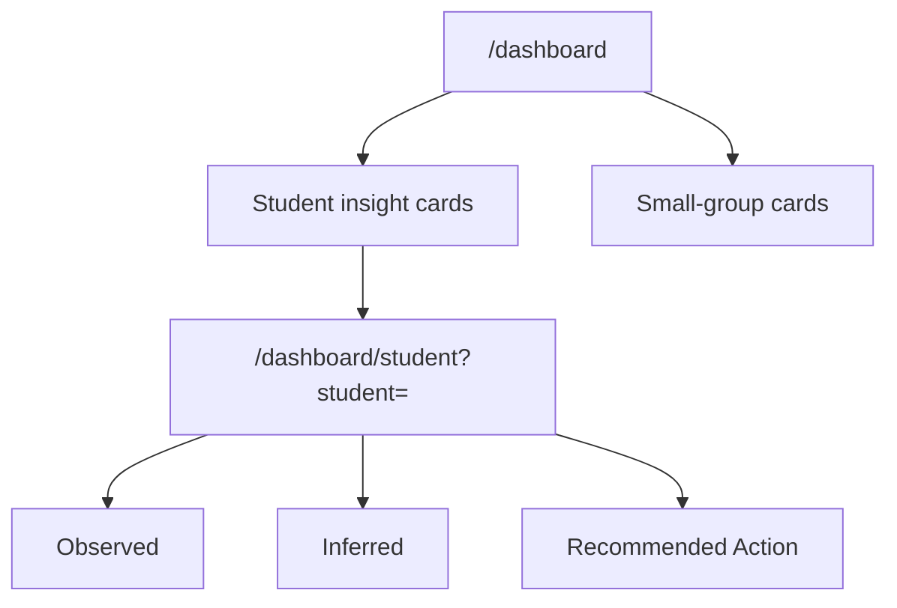

# Lane 5 Teacher Insight UI

## Summary

- reshaped `/dashboard` around the teacher evidence workflow instead of a generic class-activity summary
- split teacher insight rendering into focused student and small-group cards
- added a student drill-down view at `/dashboard/student?student=<id>` that keeps `Observed`, `Inferred`, and `Recommended Action` visibly separate

## Main System Map

- not updated; this lane changes the teacher-facing dashboard workflow within the existing top-level dashboard boundary

