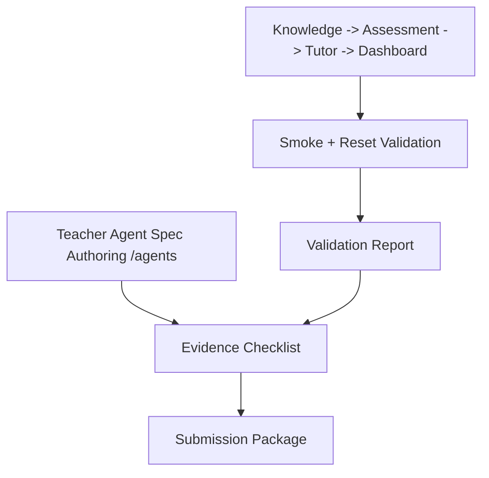

# PR Note: Lane 6 Evaluation, Evidence, and Contest Readiness

Date: 2026-04-26
Task ID: `L6_EVALUATION_EVIDENCE_READINESS`
Commit tag: `L6`
Branch: `docs/evaluation-evidence-readiness`

## Summary

This lane updates contest-facing and AI-first mirror docs to keep the hybrid proof narrative accurate:

- teacher authoring proof on `/agents` is documented;
- evidence-loop proof remains anchored to smoke-backed artifacts;
- runtime binding claims are explicitly calibrated to avoid overstatement.

## Architecture Impact

- Runtime/product code: unchanged.
- Documentation contracts: updated in `docs/contest/` and compact mirrors under `ai_first/`.
- `ai_first/architecture/MAIN_SYSTEM_MAP.md`: not updated in this lane (no system-structure change introduced).

## Diagram

## Risk Notes

- Hybrid proof screenshots for `/agents` are marked pending (`Stale`) until a future smoke-backed capture run.
- Existing smoke-backed evidence for the core loop remains `Current` as of 2026-04-26.
