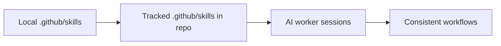

# PR Note: Local Skills Import

Date: 2026-04-26
Commit tag: `OPS-COMMIT`
Branch: `docs/local-skills-import`

## Summary

This PR imports the local `.github/skills/` bundle into the repository so skill definitions and helper assets are versioned and shareable across sessions.

## Scope

- Added: `.github/skills/**`
- Added: this PR note under `docs/superpowers/pr-notes/`
- Runtime/product code: unchanged

## Architecture Impact

- `ai_first/architecture/MAIN_SYSTEM_MAP.md`: not updated (no runtime architecture change)
- This is repository workflow knowledge content only

## Diagram

