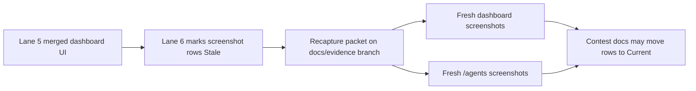

# PR Note: Dashboard And Agents Evidence Recapture Packet

## Summary

- Adds the dedicated docs-only task packet for recapturing stale contest screenshots after Lane 5 changed the dashboard workflow.
- Advances the AI-first queue from merged Lane 6 docs alignment to the next bounded browser-backed evidence task.
- Keeps screenshot freshness claims explicit by requiring real artifact recapture before any `Stale` row can move back to `Current`.

## Architecture impact

- `ai_first/architecture/MAIN_SYSTEM_MAP.md` was not updated because this PR only creates a docs/evidence execution packet and queue handoff.

## Files changed

- `docs/superpowers/tasks/2026-04-26-dashboard-agents-evidence-recapture.md`
- `docs/superpowers/pr-notes/2026-04-26-ops-evidence-recapture-packet.md`
- `ai_first/ACTIVE_ASSIGNMENTS.md`
- `ai_first/EXECUTION_QUEUE.md`
- `ai_first/daily/2026-04-26.md`

## Validation

- `rg -n "Stale|Current|dashboard|/agents|screenshots|recapture" docs/contest ai_first docs/superpowers/tasks docs/superpowers/pr-notes -S`
- `git diff --check -- ai_first/ACTIVE_ASSIGNMENTS.md ai_first/EXECUTION_QUEUE.md ai_first/daily/2026-04-26.md docs/superpowers/tasks/2026-04-26-dashboard-agents-evidence-recapture.md docs/superpowers/pr-notes/2026-04-26-ops-evidence-recapture-packet.md`
