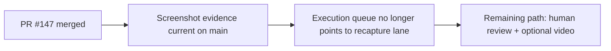

# PR Note: Post-147 Evidence Merge Sync

## Summary

- Syncs the compact AI-first mirrors after PR `#147` merged.
- Removes the completed screenshot recapture lane from the active queue.
- Reframes the remaining work as human review, optional video, and submission sign-off.

## Architecture impact

- `ai_first/architecture/MAIN_SYSTEM_MAP.md` was not updated because this PR only refreshes control-plane mirrors after a docs/evidence merge.

## Files changed

- `ai_first/ACTIVE_ASSIGNMENTS.md`
- `ai_first/EXECUTION_QUEUE.md`
- `ai_first/daily/2026-04-26.md`
- `docs/superpowers/tasks/2026-04-26-post-147-evidence-merge-sync.md`
- `docs/superpowers/pr-notes/2026-04-26-post-147-evidence-merge-sync.md`

## Validation

- `rg -n "#147|screenshot|human review|optional video|ACTIVE_ASSIGNMENTS|EXECUTION_QUEUE" ai_first docs/superpowers/tasks docs/superpowers/pr-notes -S`
- `git diff --check -- ai_first/ACTIVE_ASSIGNMENTS.md ai_first/EXECUTION_QUEUE.md ai_first/daily/2026-04-26.md docs/superpowers/tasks/2026-04-26-post-147-evidence-merge-sync.md docs/superpowers/pr-notes/2026-04-26-post-147-evidence-merge-sync.md`
