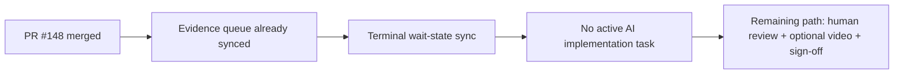

# PR Note: Post-148 Terminal Wait-State Sync

## Summary

- Syncs the control-plane after PR `#148` so the repository no longer advertises any active AI implementation task.
- Aligns the compact queue and compatibility snapshots on a human-review wait state.
- Keeps the next AI entry point explicit: only start again when a fresh packet is opened from `main`.

## Architecture impact

- `ai_first/architecture/MAIN_SYSTEM_MAP.md` was not updated because this PR only refreshes operating mirrors and wait-state docs.

## Files changed

- `ai_first/ACTIVE_ASSIGNMENTS.md`
- `ai_first/EXECUTION_QUEUE.md`
- `ai_first/CURRENT_STATE.md`
- `ai_first/NEXT_ACTIONS.md`
- `ai_first/daily/2026-04-26.md`
- `docs/superpowers/tasks/2026-04-26-post-148-terminal-wait-state-sync.md`
- `docs/superpowers/pr-notes/2026-04-26-post-148-terminal-wait-state-sync.md`

## Validation

- `rg -n "#148|human review|optional video|no active AI|ACTIVE_ASSIGNMENTS|EXECUTION_QUEUE|CURRENT_STATE|NEXT_ACTIONS" ai_first docs/superpowers/tasks docs/superpowers/pr-notes -S`
- `git diff --check -- ai_first/ACTIVE_ASSIGNMENTS.md ai_first/EXECUTION_QUEUE.md ai_first/CURRENT_STATE.md ai_first/NEXT_ACTIONS.md ai_first/daily/2026-04-26.md docs/superpowers/tasks/2026-04-26-post-148-terminal-wait-state-sync.md docs/superpowers/pr-notes/2026-04-26-post-148-terminal-wait-state-sync.md`
