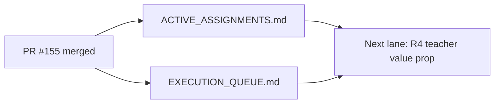

# PR Note: Post-155 Risk Sync

## Summary

- clear the stale `R3_ASSESSMENT_SAFETY` assignment from `main`
- update the compact execution queue so future AI workers see `R4_TEACHER_VALUE_PROP` as the next optional risk-hardening lane

## Architecture

## Main System Map

- Not updated. This PR only synchronizes AI-first control-plane docs after a merge.

## Validation

- `git diff --check`
