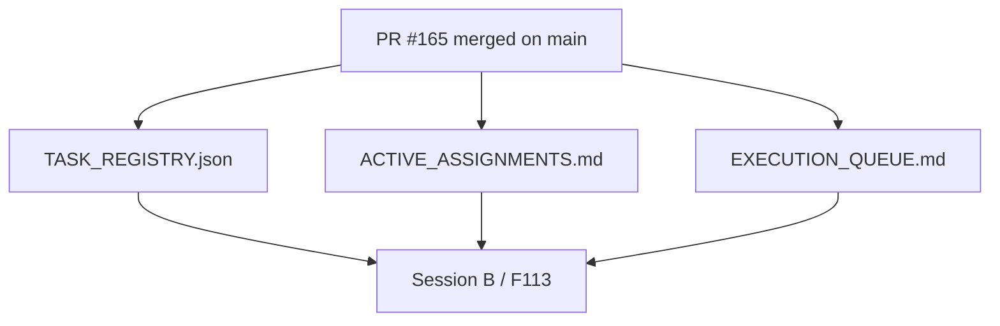

# PR Architecture Note: Post-165 F101 Control-Plane Sync

## Summary

This PR advances the AI-first control plane after `F101_TEACHER_ACTION_EXECUTION_LOOP` merged to `main`. It removes Session A from the active assignment board, marks `F101` as completed in the task registry, and keeps Session B focused on `F113_CAPABILITY_WIDE_RUNTIME_BINDING_COVERAGE` through the merged two-session backlog packet.

## Mermaid Diagram



## Files Changed

- `ai_first/ACTIVE_ASSIGNMENTS.md`
- `ai_first/EXECUTION_QUEUE.md`
- `ai_first/TASK_REGISTRY.json`
- `ai_first/daily/2026-04-26.md`
- `docs/superpowers/pr-notes/2026-04-26-post-165-f101-sync.md`

## Main System Map Update

`ai_first/architecture/MAIN_SYSTEM_MAP.md` was not updated. This PR only synchronizes AI-first task state after `F101` merged; it does not change runtime topology or product architecture.

## Validation

```bash
python -m json.tool ai_first/TASK_REGISTRY.json >/dev/null
git diff --check
```

## Handoff Notes

- `F101_TEACHER_ACTION_EXECUTION_LOOP` is complete on `main`.
- Session B remains the only active implementation lane through `F113_CAPABILITY_WIDE_RUNTIME_BINDING_COVERAGE`.
- The active assignment board now points to the merged two-session startup packet instead of an untracked local design file.
